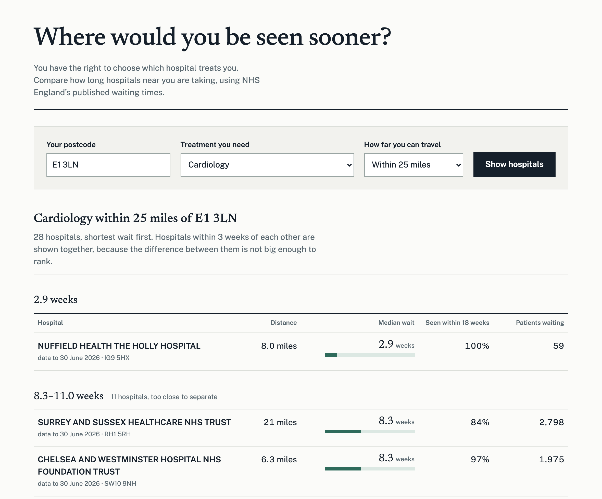

# WaitWise

People in England wait months for planned treatment without knowing they have a
legal right to choose which hospital treats them, and the waiting times that
would inform that choice are published as spreadsheets nobody reads. WaitWise
turns those spreadsheets into one question: where near you would you be seen
sooner?

**Live: https://waitwise-tau.vercel.app**

Search cardiology from **E1 3LN**, in Tower Hamlets. The local trust, half a
mile away, has a median wait of **9.6 weeks with 8,603 people queued**. Eight
miles away the wait is **2.9 weeks** — at a much smaller service, with 59 people
waiting. Both figures are NHS England's own, published in the same release, for
the same month.



Measured, not asserted:

- **Reconciles to zero difference on 7,147,562 patients.** `npm run validate`
  checks every provider total against NHS England's separate full CSV extract,
  and exits non-zero on any mismatch.
- **552 providers geocoded, no failures.** Every one resolved through the NHS
  Organisation Data Service and postcodes.io — no missing address, postcode or
  coordinate.
- **Waits within three weeks of each other are not ranked.** They are shown as a
  tied group, because the data does not support ordering them.
- **A suppressed median is never shown as zero.** NHS England withholds the
  figure where few patients are waiting; that is displayed as "not published",
  separately from hospitals with nobody waiting at all.

## Setup

Verified on Node 26 and Postgres 17. The scripts are TypeScript run directly by
Node with no build step, so Node must be recent enough to strip types natively;
Postgres 14 or newer.

```bash
npm install
cp .env.example .env       # then edit DATABASE_URL
npm run db:migrate
npm run dev                # http://localhost:3000
```

The database must exist before you migrate; the migration creates tables, not
the database. On a local server that is `createdb waitwise`. On Neon, Supabase
or RDS, create it in their console.

`DATABASE_URL` must be the connection string alone — no `DATABASE_URL=` prefix,
no wrapping quotes, no `psql '...'` around it. Anything before the scheme parses
into a host called `base`, taken from the middle of the word "database", and
fails much later as `getaddrinfo ENOTFOUND base`. The app rejects such a value
at startup and names the mistake.

**TLS.** If the connection string already carries `sslmode` — as Neon's and
Supabase's do — leave `DATABASE_SSL` unset. The driver reads `sslmode` itself and
verifies the certificate. Setting `DATABASE_SSL=true` maps to
`rejectUnauthorized: false`, which *downgrades* a verified connection to an
unverified one. Set it only for a host that requires TLS but presents a
certificate the driver cannot verify, such as a self-signed one, and understand
that it disables verification.

`db:migrate` applies every `db/migrations/*.sql` not yet recorded, each in its
own transaction, and records it in `schema_migrations`. It is safe to re-run —
a second run reports `no pending migrations`.

With an empty database the app starts and the page renders, but the treatment
list is built from the loaded data, so it is empty until you load a workbook.
Do that next.

### Deploying

```bash
npm run build
npm start
```

The page is `force-dynamic` and queries Postgres per request, so it needs a Node
runtime, not static hosting. Set `DATABASE_URL` in the host's environment — see
the TLS note above before reaching for `DATABASE_SSL`; nothing else is
configured.
The connection pool is created lazily and reused, so it survives across
requests.

One outbound call is made at request time — postcodes.io, to geocode the search
— so the host needs outbound HTTPS. `npm run load:providers` also calls the NHS
ODS API, but only when you run it.

Data loading is a separate step from deployment: run the loaders against the
same `DATABASE_URL`, from anywhere that can reach it.

Run the function next to the database. `app/page.tsx` declares
`preferredRegion = 'lhr1'` so the choice travels with the code, but for the
Node.js runtime the region Vercel actually uses comes from the project's
function settings (or `regions` in `vercel.json`) — set it there too. The first
deployment ran in `iad1` against a database in `eu-west-2`, so every query
crossed the Atlantic twice.

If a render fails, `app/error.tsx` shows what went wrong and the error digest,
which is the handle the runtime logs share with the page. Connections give up
after five seconds rather than hanging until the platform kills the function.

## Loading waiting-time data

Fifteen months (April 2025 to June 2026) are loaded, in development and in the
live deployment: 172,638 snapshots across 552 providers. The loaders are
idempotent, so re-running any file replaces its figures rather than duplicating
them.

1. Download an **Incomplete Provider** workbook from NHS England's
   [RTT waiting times](https://www.england.nhs.uk/statistics/statistical-work-areas/rtt-waiting-times/)
   page and drop the `.xlsx` into `./data/`.

2. Look at the raw rows before anything is parsed:

   ```bash
   npm run inspect              # first 15 rows of every sheet, unparsed
   npm run inspect -- --merges  # also list the merged ranges
   ```

   The 2025-26 and 2026-27 releases carry six sheets, with a block of metadata
   rows and a caption above a single header row at row 14. Earlier releases
   differ, which is why the loader derives the layout rather than assuming it —
   confirm it here first.

3. See what the loader derives from it, without writing:

   ```bash
   npm run load -- --dry-run
   ```

   It prints, per sheet, the header row and the column it picked for every
   field. If that mapping is wrong, correct it rather than editing the parser:

   ```bash
   npm run load -- --sheet Provider --header-row 14 --map patients_waiting=DH,median_wait_weeks=DK
   ```

4. Load it:

   ```bash
   npm run load
   ```

### Flags

| Flag | Meaning |
| --- | --- |
| `--file <path>` | Workbook to read. Defaults to the only `.xlsx` in `./data`. |
| `--sheet <name>` | Read only this sheet. Defaults to every sheet whose header maps. |
| `--header-row <n>` | Force the header row instead of detecting it. |
| `--period <YYYY-MM-DD>` | Reporting month end. Defaults to the month parsed from the filename. |
| `--source <text>` | Value stored in `wait_snapshots.source`. |
| `--scan <n>` | Rows searched for the header row (default 30). |
| `--map field=COL` | Override detected columns, by letter or index. |
| `--dry-run` | Parse and report, write nothing. |

## How the parsing works

Nothing about the layout is hardcoded. For each sheet the loader scans the
opening rows, joins each header row with the rows merged above it into one
label per column, and matches those labels against patterns per field. Labels
are matched both stacked and on their own, because a caption sitting above the
table ("Provider Level Data") gets stacked onto every column beneath it. The
mapping it derived is always printed. If a required column
(`provider_code`, `treatment_function_code`, `patients_waiting`) is missing it
prints every label it saw and stops, instead of guessing.

**Every qualifying sheet is loaded, not just the first.** The release splits
providers across `Provider` (NHS trusts) and `IS Provider` (independent sector),
and a patient exercising choice can be referred to either. The `with DTA` sheets
are recognised and skipped: they count incomplete pathways *with a decision to
admit for treatment*, a subset of the main measure, so loading them would double
count. That is decided from the total column's own label, not the sheet name.
Any provider and treatment function appearing on two sheets is reported as a
warning, since the upsert would otherwise keep whichever sheet was read last.

Values that are suppressed in the release (`*`, `-`) become `NULL`, never `0`,
so "suppressed" never reads as "no wait". Percentages stored as Excel fractions
(`0.612`) are scaled to percent. Aggregate rows (`Total`, TFC `C_999`) are
skipped, since they are not providers a patient can choose.

## Loading provider addresses and coordinates

```bash
npm run load:providers                 # only providers still missing details
npm run load:providers -- --dry-run    # fetch and report, write nothing
npm run load:providers -- --refresh    # re-fetch every provider
```

The RTT workbook carries only a provider's code and name, so locations come from
the NHS [Organisation Data Service](https://directory.spineservices.nhs.uk/ORD/2-0-0/organisations).
ORD has no coordinates, so postcodes are geocoded through
[postcodes.io](https://postcodes.io); terminated postcodes fall back to that
service's terminated-postcode lookup. Neither API needs a key.

Responses are cached in `data/.ods-cache.json`, so a re-run costs no requests.
Only the location columns are written — `name` stays as the RTT workbook spelled
it, so provider names match the waiting-time data.

| Flag | Meaning |
| --- | --- |
| `--refresh` | Ignore the cache and re-fetch every provider. |
| `--dry-run` | Fetch and report, write nothing. |
| `--concurrency n` | Simultaneous ORD requests (default 6). |
| `--limit n` | Stop after n providers, for a trial run. |

## Validating a month against the full extract

NHS England also publishes a full CSV extract of the same month, split by
commissioner. Reconciling the two catches a parsing regression before the
figures reach anyone.

```bash
npm run validate -- --file data/Incomplete-Provider-Jun26-...xlsx \
                    --csv data/20260630-RTT-June-2026-full-extract.csv
```

It exits non-zero if anything fails to reconcile, so it can gate a monthly load.
`--file` and `--csv` default to the only `.xlsx` and `.csv` in `./data`;
`--limit` caps how many mismatching providers are listed (default 20).

The two publications do not agree line for line by design: the provider workbook
excludes the `NONC` commissioner (patients commissioned outside England) and the
extract includes it, so those rows are removed from the CSV side first. On the
June 2026 release that alone accounts for all 113 providers that otherwise
differ, and the remaining 537 then match exactly, to a grand total of 7,147,562
patients.

It also checks that both files are for the same month, since pairing the wrong
two produces hundreds of mismatches that look like a parsing bug. Two details in
the extract are easy to get wrong and are handled here: the `Total` column is
empty on incomplete-pathway rows (`Total All` carries the figure), and fields
are quoted because commissioner names contain commas, so it cannot be split
naively.

## Schema

`providers` — one row per organisation, keyed on `ods_code`. The RTT workbook
supplies code and name; `address`, `postcode`, `lat` and `lng` come from
`npm run load:providers` and are never overwritten by the waiting-time loader.

`wait_snapshots` — one row per provider × specialty × month × source, unique on
`(ods_code, treatment_function_code, period_end, source)`. Re-running a load, or
loading a revised release of the same month, updates in place rather than
duplicating.

## Tests

```bash
npm test
```

Six suites, none of which needs a database server or a network connection —
`test:schema`, `test:load` and `test:search` run against an in-process Postgres
(PGlite).

- `test:schema` applies the migrations and checks the constraints the loaders
  depend on: the upsert key, the foreign key, and suppressed values staying
  `NULL`.
- `test:load` builds a workbook with the awkward shapes — a cover sheet, a
  caption row above a single header row, a second provider sheet whose header is
  split over two merged rows, a decision-to-admit sheet that must be ignored,
  thousands separators, suppressed values and total rows — then parses, loads
  and re-loads it to prove the upsert is idempotent.
- `test:search` covers the ranking judgements: tie grouping and its boundaries,
  the activity window, and the freshness cut-off.
- `test:ods` checks the ODS response handling against recorded payloads.
- `test:csv` checks the CSV reader against quoted commas, doubled quotes and a
  value spanning a read-buffer boundary — the shapes that silently misalign
  every column after them.
- `test:db` checks the connection-string guard, including that no error message
  ever echoes the value, which may be or contain the password.

To eyeball the sample workbook itself:

```bash
node scripts/fixtures/make-sample-xlsx.ts data/sample.xlsx
npm run inspect -- --file data/sample.xlsx --merges
```

## The search page

```bash
npm run dev     # http://localhost:3000
```

One server-rendered page: postcode, treatment, distance. The form submits as a
GET, so results are a shareable URL and there is no client-side state.

Two judgements are worth knowing about, because they shape what patients see:

**Waits that are close are not ranked against each other.** Walking down the
sorted list, the shortest ungrouped wait anchors a group and takes everyone
within three weeks of *it*. Chaining from each successive provider instead would
let a run of small gaps swallow the list, so a 4-week and a 16-week wait could
end up presented as equivalent. `TIE_TOLERANCE_WEEKS` in `lib/search.ts` sets
the width, currently 3.

**A provider that published no median is shown, not hidden — but the two reasons
are separated.** NHS England suppresses the median where only a handful of
patients are waiting; that provider appears under "wait not published" with its
real figures, because a suppressed number is not a short wait. A provider with
nobody waiting appears under "no one waiting now", with dashes rather than "0%"
and "0", which would read as terrible service rather than an absent queue.

**A provider with nobody waiting for a treatment through the whole activity
window is not listed for it.** The workbook publishes a complete provider x
specialty grid, so a private eye clinic gets a cardiology row of zeros. One
month cannot tell "does not offer this" from "cleared the queue", so the test
runs over `ACTIVITY_WINDOW_MONTHS` (6) of recent data. Every loaded month stays
in the table; only the filter uses the window.

Six is not arbitrary. On 15 loaded months the kept count is flat from a 2-month
window through a 9-month one, and only grows at 10+, where it readmits services
that saw a single patient over a year ago. Six sits mid-plateau: long enough to
survive a seasonal gap, short enough to exclude a service that quietly stopped.

Each provider is shown at its own most recent month, and every row carries that
`period_end` as "data to 30 June 2026", so a stale month can never be mistaken
for the current one.

**A provider whose latest figures are more than `MAX_MONTHS_BEHIND` (1) month
behind the newest loaded period is not shown at all.** A wait frozen in the past
does not grow, so a stale row ranks better than a current one and lands at the
top — the bias points at exactly the wrong answer. RTT submission is monthly and
mandatory, so a provider missing from the newest month has stopped reporting and
has no current figure to compare. The one month of tolerance absorbs a late
submission, which is the only legitimate reason to be behind. On the loaded data
this excludes 15 providers.

The postcode is geocoded through postcodes.io on each search. If that fails the
page says which failed — an unrecognised postcode or an unreachable service —
and shows nothing, rather than falling back to a default location that would
produce a plausible but wrong ranking.

## Licence and data

The code is MIT licensed; see [LICENSE](LICENSE).

The data is not ours and carries its own terms. This project contains public
sector information licensed under the
[Open Government Licence v3.0](http://www.nationalarchives.gov.uk/doc/open-government-licence/version/3/):

- Referral to treatment waiting times, © NHS England.
- Organisation Data Service records, © NHS England.
- Postcode coordinates via [postcodes.io](https://postcodes.io), derived from the
  ONS Postcode Directory: contains OS data © Crown copyright and database right;
  contains Royal Mail data © Royal Mail copyright and database right; contains
  National Statistics data © Crown copyright and database right.

Waiting times shown by this project are a reformatting of NHS England's
published figures. It is not affiliated with or endorsed by NHS England.

## Known limitations

- **No sector marker.** Independent-sector providers and NHS trusts are ranked
  side by side with nothing distinguishing them.
- **Postcode lookups are not cached.** Every search calls postcodes.io.
- **Distances are straight-line**, not travel time.

## Next steps

- Mark which providers are independent sector rather than NHS trusts.
- Travel time rather than straight-line distance.
